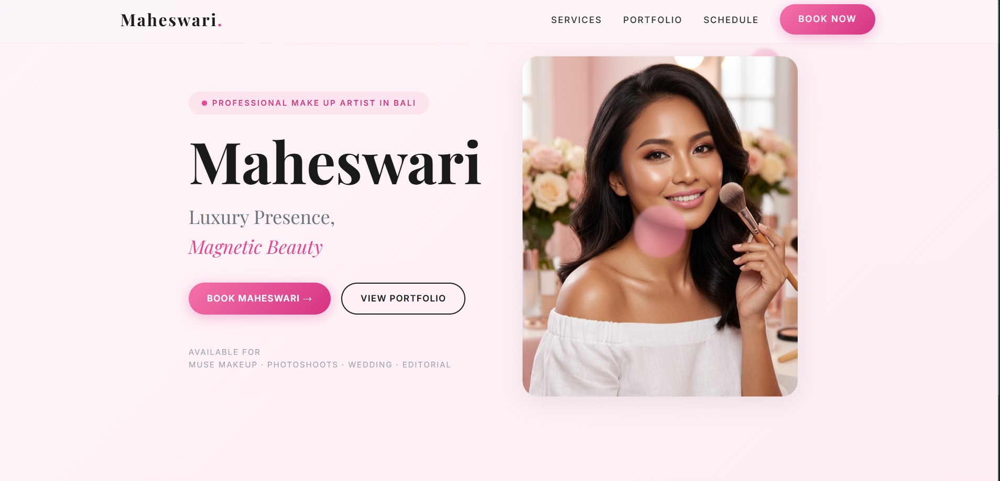
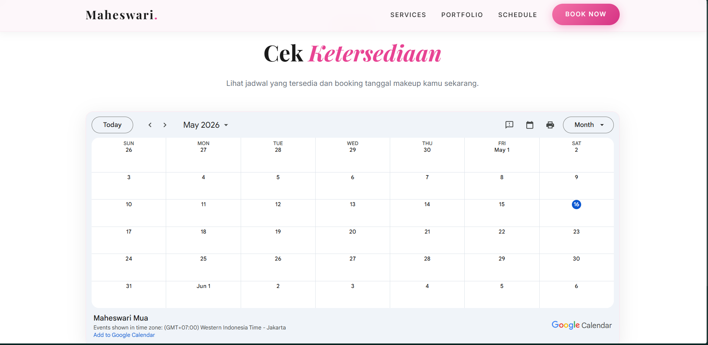
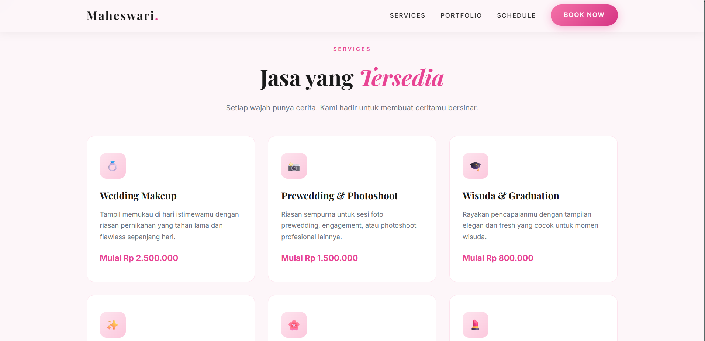
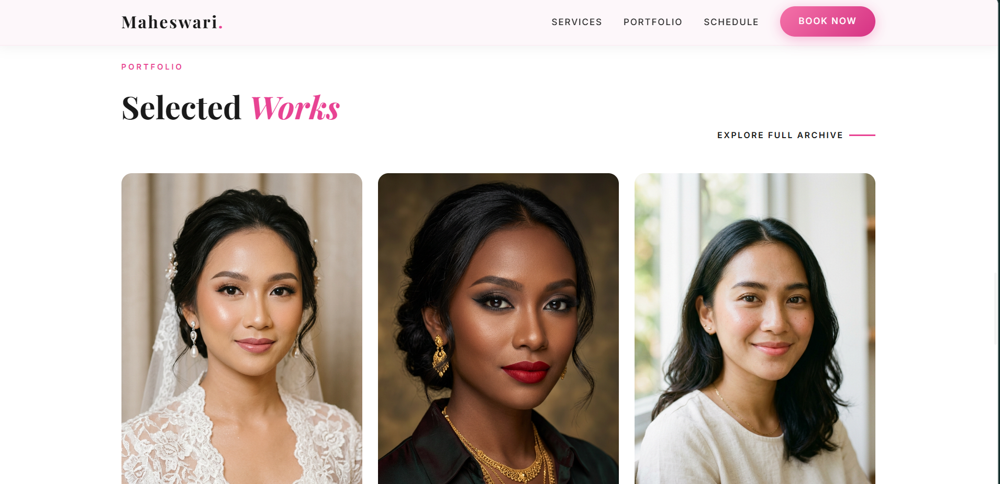
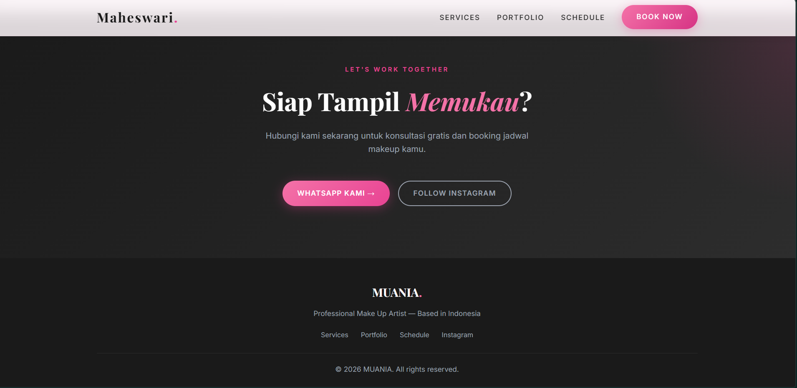

# Maheswari — Professional MUA Landing Page

Website landing page elegan dan responsif yang dirancang khusus untuk Make-Up Artist (MUA). Website ini fokus pada visual portofolio yang bersih, informasi layanan yang jelas, dan kemudahan booking jadwal bagi calon klien.

## ✨ Fitur Utama

* **Desain Elegan & Mewah**: Menggunakan tipografi klasik (*Playfair Display*) dan modern (*Inter*) untuk menciptakan kesan profesional.
* **Fully Responsive**: Tampilan yang optimal di berbagai perangkat, mulai dari desktop hingga smartphone.
* **Integrasi Google Calendar**: Memungkinkan klien melihat ketersediaan jadwal secara *real-time* langsung di website.
* **Galeri Portofolio**: Menampilkan karya terbaik dengan *overlay* deskripsi dan efek *hover* yang halus.
* **Interactive UI**: Dilengkapi dengan menu hamburger untuk mobile, navigasi yang menempel saat di-scroll (*sticky*), dan animasi *reveal* saat elemen muncul di layar.
* **Call to Action (CTA)**: Tombol booking yang terintegrasi langsung ke WhatsApp untuk konversi klien yang lebih cepat.

## 🚀 Teknologi yang Digunakan

* **HTML5**: Struktur semantik untuk SEO yang lebih baik.
* **CSS3**: Menggunakan CSS Variables untuk manajemen warna yang mudah, Flexbox, dan CSS Grid untuk tata letak yang kompleks.
* **Vanilla JavaScript**: Digunakan untuk logika menu mobile, deteksi scroll, dan animasi *reveal* menggunakan `IntersectionObserver`.
* **Google Fonts**: Mengintegrasikan font *Playfair Display* dan *Inter*.

## 📁 Struktur Folder

```text
├── css/
│   └── style.css      # Pengaturan variabel warna, tipografi, dan layout
├── img/
│   ├── hero-mua.png   # Gambar utama di bagian hero
│   └── gallery-*.png  # Koleksi gambar portofolio
├── js/
│   └── main.js        # Logika interaksi navigasi dan animasi
└── index.html         # Struktur utama website
```

## 🖼️ Gallery Aplikasi
<p align="center">
    
    
    
    
    
</p>
